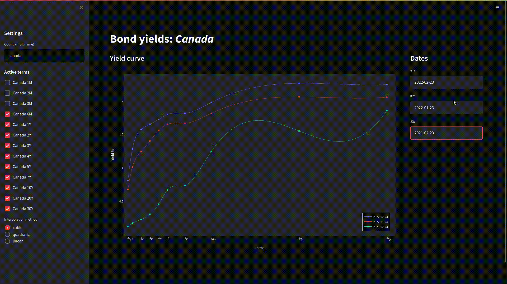

yieldcurves
====

Interface to search and analyze sovereign bond yields.




Setup
-----

Simply clone this repository and install the dependencies. Requires `python>=3.8`:

```shell
# Clone the repo
git clone git@github.com:felipeslanza/yieldcurves.git

# Setup environment and install dependencies
cd yieldcurves
virtualenv -p python3.8 venv
source venv/bin/activate
pip install -r requirements.txt
```


Usage
-----

Launch the `streamlit`-based app:

```shell
streamlit run yieldcurves/__main__.py
```
